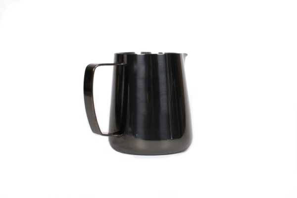
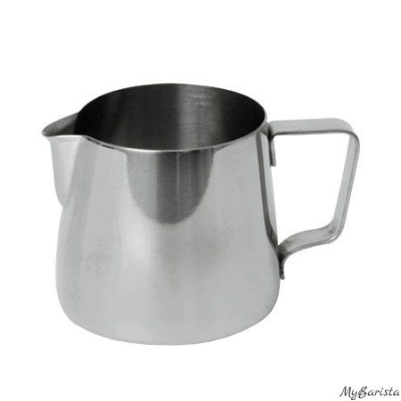

# Барный инвентарь на одну кофейню

Каждое наименование является ссылкой на магазин, где можно купить тот или иной инвентарь

На одной дочке должны быть:

* Питчер 1000мл 1 штука

* Питчер 1000мл 2-3 штуки на холодном баре

* Питчер 600мл 4 штуки

* Питчер 400мл 2 штуки

**Питчеры:**

**[Питчер 600мл: Barista Hustle cosmic black](http://cocarcoffee.com/product/precision-milk-pitcher/)**

**[Питчер 400мл: Barista Hustle cosmic black](http://cocarcoffee.com/product/precision_milk_pitcher_cosmic_black/)**

**[Питчер 1000 мл : холодный бар](https://xn----7sbac0b0bhdkke.xn--p1ai/products/pitcher1000)

**[Питчер 150 мл: обычный для эспрессо](https://xn----7sbac0b0bhdkke.xn--p1ai/products/molochnik150)**

----

**[Весы недорогие](https://xn----7sbac0b0bhdkke.xn--p1ai/products/profi)**

**[Перо для латте-арт](https://xn----7sbac0b0bhdkke.xn--p1ai/products/46836583)**

---

LICENSE: [MIT](./license.md)

